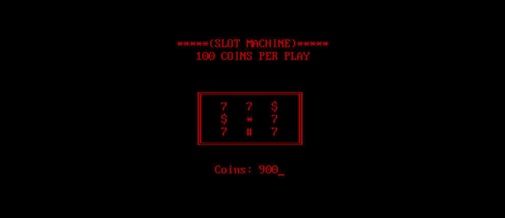
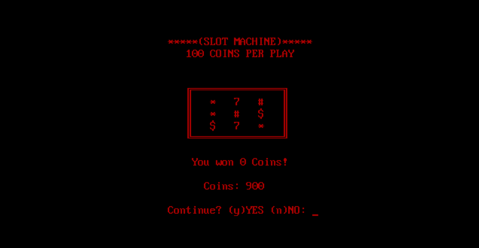
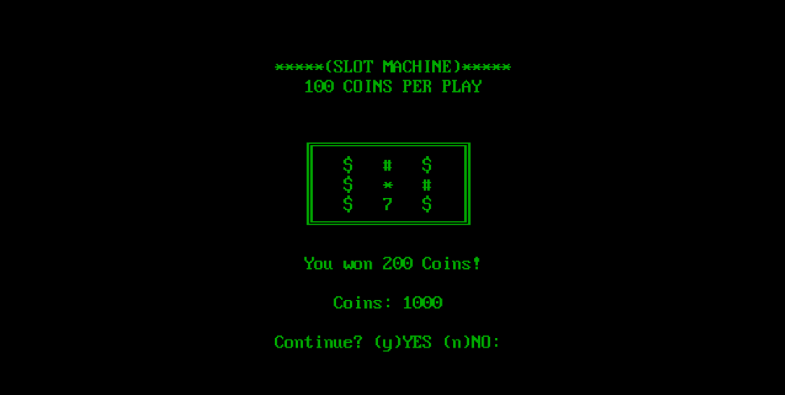

# Slot Machine

A simple slot machine game written in C++98 in DOS (I know, my class's syllabus was *kind of* outdated) for my grade 11 computer science class.

# How it works

The player starts with 1000 coins, spins the wheel for 100 coins each time and is awarded coins when alignments are formed.

When the program is executed, the wheel is spun with each column beginning to spin at a slightly different timing.

Eventually each column stops spinning (again, at slightly different timings).

If none of the symbols align in any row, column or diagonal, the player does not gain any points and the below screen is displayed.

If the user presses ‘y’ (provided the user has at least 100 coins) the wheel is spun again at the cost of 100 coins.  

*If the user attempts to carry on with the game despite not having enough coins, the game forcefully ends with a “G A M E  O V E R” screen.* 

If ‘n’, the program is quit.  

On the other hand if an alignment does occur, all characters turn green and the aligned symbols blink for a while. Subsequently the following screen is displayed: 

The user is awarded a number of coins depending on the number of alignments formed and the game continues.
